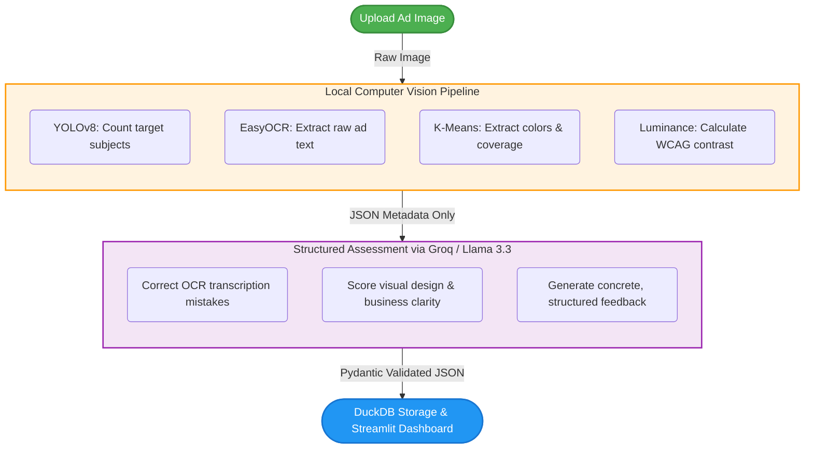

# 🎯 AI Creative Auditor

**AI Creative Auditor** is a practical tool built for marketing teams and business analysts. It takes the guesswork out of ad design reviews by combining **local Computer Vision (CV)** with **structured LLM evaluations** and **DuckDB analytical dashboards**. 

Whether you want to audit a single banner, compare two creatives side-by-side (A/B testing), or track long-term performance trends across your visual assets, this tool provides concrete, objective design metrics.

⚡ **[Launch the Live Demo on Hugging Face Spaces](https://huggingface.co/spaces/Bright87/ai-creative-auditor)**  
🔒 *Privacy First: Your raw images never leave the host server. The pipeline processes computer vision tasks locally, sending only anonymous metadata to the LLM API.*

---

## 🚀 The Upgrade: V1 vs. V2

### Where it started (V1)
The project began as a simple prototype. Users uploaded a single image, and the system extracted text, counted people, and used an LLM to generate a single design score with a brief feedback block. 

### Why we rebuilt it (V2)
While the prototype worked, it didn't solve real-world problems. Marketers needed to compare assets, designers needed actionable layout feedback, and analysts needed data they could export and query. We updated the architecture to make it a professional-grade portfolio app:

* **Dual-Track Scoring System**: Instead of one generic score, V2 evaluates creatives across two key tracks: **Design Score** and **Business Score**. These are broken down into four distinct categories: Visual Hierarchy, Color Psychology, Message Clarity, and Target Audience Fit.
* **Color Psychology & Extraction**: Moving beyond basic color names, the pipeline uses K-Means Clustering to identify dominant HEX values and their exact canvas coverage %. It then maps these colors to visual psychology tags (e.g., trust, excitement, warmth).
* **Built-in WCAG Contrast Checks**: A helper utility samples the text and background pixels inside OCR boundaries, calculating relative luminance contrast ratios. If your text is hard to read, the system flags it.
* **Side-by-Side A/B Comparisons**: Upload two creatives simultaneously to compare scores, analyze performance delta metrics, and automatically determine a clear winner.
* **Visual Asset Catalog**: The Mock Analytics dashboard features an image gallery pulled directly from DuckDB, allowing teams to filter, search, and visually audit their entire creative library alongside their metrics.

### Under the Hood (Performance & UI)
* **Instant Startups**: YOLOv8 and EasyOCR models are pre-cached inside the Docker image during the build stage. You no longer have to wait minutes for model weights to download on first run.
* **No Layout Jumps**: Added structural CSS min-height rules and clean fade-in animations to eliminate annoying screen flickering when switching tabs.
* **Stable DB Storage**: Re-architected DuckDB data pipelines to support Git LFS, with custom scripts for deploying binary-heavy histories to Hugging Face Spaces cleanly.

---

## 🛠️ How It Works



---

## 📂 Project Structure

```
├── app.py                 # Main Streamlit dashboard (Audit, A/B Testing, Analytics tabs)
├── ui_helpers.py          # Plotly charts, score gauges, and rendering layouts
├── vision_ops.py          # Image processing core (YOLO, EasyOCR, K-Means clustering, WCAG contrast)
├── run_pipeline.py        # Groq client integration and offline batch pipeline
├── schemas.py             # Pydantic models for structured output validation
├── database_ops.py        # DuckDB connector and query functions
├── init_db.py             # Database creation and table initialization
├── migrate_db_v2.py       # DB schema migration utility
├── assets/custom.css      # Styling rules and page transition fixes
├── docs/CASE_STUDY.md     # In-depth business study, GDPR compliance notes, and limitations
├── tests/                 # Unit test suite (pytest)
└── Dockerfile             # Multi-stage build configuration
```

---

## 💻 Running Locally

### 1. Clone the Project & Install Requirements
```bash
git clone https://github.com/Bright579523/ai-creative-auditor.git
cd ai-creative-auditor

pip install -r requirements.txt
```

### 2. Set Up Your Environment
Copy the example environment file and add your Groq API key:
```bash
copy .env.example .env
# Edit .env and enter: GROQ_API_KEY=gsk_your_key_here
```

### 3. Initialize & Populate the Database
Create your local DuckDB database and run the batch processor to analyze the demo images:
```bash
python init_db.py
python run_pipeline.py
```

### 4. Launch the Dashboard
```bash
streamlit run app.py
```
Open `http://localhost:8501` in your browser.

---

## 🧪 Testing

To run the unit test suite and check code formatting:
```bash
pip install pytest ruff
ruff check .
pytest tests/ -v
```

---

## 📄 License

This project is licensed under the MIT License — see the [LICENSE](LICENSE) file for details.
